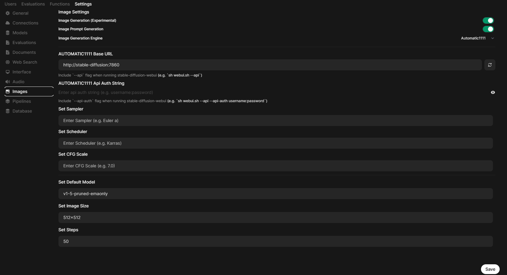

# Open WebUI with Ollama Setup Script

This repository contains a shell script to set up and configure Open WebUI with Ollama.


https://github.com/user-attachments/assets/4dbb7ed6-ba18-41be-83d0-62d6f3cf2514


## My System Configuration:
- Processor: Intel Core i7-11800H (8 Cores, 16 Threads) @ 2.30GHz
- RAM: 16GB
- GPU: NVIDIA GeForce RTX 3050 Ti Laptop GPU

## Prerequisites

Before running the script, ensure you have the following installed on your system:
- Docker
- GPU drivers compatible with Docker and NVIDIA
- Sufficient disk space for the models and data volumes
- The models folder copied from [AUTOMATIC1111](https://github.com/AUTOMATIC1111/stable-diffusion-webui) GitHub repository to the same directory as the ```docker-compose.yml```

## Usage

1. **Clone the repository or copy the script:**
   Save the `setup_open_webui.sh` and the `docker-compose.yml` files in your preferred directory.

2. **Make the script executable:**
   ```bash
   chmod +x setup_open_webui.sh
3. **Run the script:**
   ```bash
   ./setup_open_webui.sh
## What the Script Does

1. **Runs the Docker containers:**

    * Initializes and builds the necessary containers using docker compose up -d --build. This command starts both the Open WebUI and Stable Diffusion services as defined in the ```docker-compose.yml```.
    * Allows the containers to utilize GPU resources for accelerated processing.
    * Configures volumes.
        * auto1111-data and auto1111-output for Stable Diffusion.
        * ollama and open-webui for Open WebUI and Ollama model storage.
    * Exposes ports.
        * Port 7860 is exposed for Stable Diffusion, enabling API access to the diffusion models.
        * Port 3000 is exposed for Open WebUI, providing access to the application interface.
    * Automatically restarts the container on failure.
  
2. **Downloads required AI models:**
   
    * Pulls the llama3.2 model.
    * Pulls the llava model.
    * Pulls the DeepSeek-R1-Distill-Qwen-7B model.
    * Pulls the stable-diffusion-prompt-generator model.
    * Pulls the codellama model.
    * Pulls the DeepSeek-R1-Distill-Llama-8B model.
  
3. **Ensures smooth setup with error handling:**

    * Checks for errors after each command and exits if an error occurs.

## Accessing Open WebUI Interface

Once the script finishes:

1. Open a browser and navigate to http://localhost:3000 to access the web interface.
2. Start interacting with the models.

## Image Generation Setup
1. Go to Profile Icon -> Settings -> Admin Settings -> Images.
2. Select Automatic1111 as Image Generation Engine.
3. Paste http://stable-diffusion:7860 in the AUTOMATIC1111 Base URL and click on the refresh icon at the right side of the text box to connect to the stable diffusion server. Note that ```stable-diffusion``` in the URL is the name of the docker container.
4. Turn On Image Generation.
5. Set ```v1-5-pruned-emaonly``` as the default model.
6. Save the settings.


## RAG Setup


https://github.com/user-attachments/assets/e92edcaf-ff40-4448-bc14-5650104c6c33


## Troubleshooting
If the setup script fails:

* Ensure Docker is installed and running.
* Verify that your GPU drivers and Docker GPU support are configured properly.
* Check if ports are available (default is 3000).

For additional support, please refer to [Open WebUI Documentation](https://docs.openwebui.com/).
